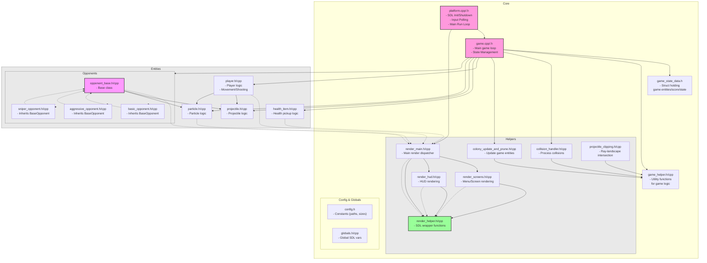
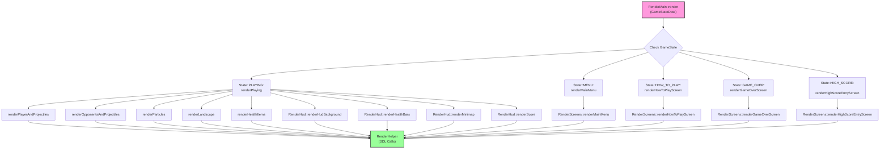

### Only tested in Fedora and POP!_OS

https://github.com/user-attachments/assets/e1225713-1a30-4bf0-b54c-7d080f8bc2a0

# Running Game

### using build script
build script (note: your highscores will be in `/build/bin/resources/`)
```bash
chmod +x build.sh # make executable
./build.sh
```

### using cmake
cmake (note: your highscores will be in `/build/bin/resources/`)
```bash
mkdir build && cd build
cmake ..
make -j
./bin/SDL3Defender
```

### simple compile
compile && run (note: your highscores will be in `/resources/`)
```bash
# compile
g++ -std=c++17 \
core/*.cpp \
core/helpers_game/*.cpp \
core/helpers_platform/*.cpp \
core/helpers_platform_rendering/*.cpp \
core/high_scores/*.cpp \
core/managers/*.cpp \
entities/*.cpp \
entities/opponents/*.cpp \
main.cpp \
`pkg-config --cflags --libs sdl3` -lSDL3_image -lSDL3_ttf -lSDL3_mixer -o m
# run
./m
```

# Project layout

### main breakdown



### rendering



# Static Analysis

### clang-tidy
generate a `compile_commands.json` file inside `/build/`
```bash
mkdir -p build
cd build
cmake -DCMAKE_EXPORT_COMPILE_COMMANDS=ON ..

```

if you get basic clang-tidy errors on things like string, vector, memory
```
# check selected GCC installation 
clang -v

# make sure that you have it
g++-n --version

# install if needed
sudo apt install g++-n

```

run on single file
```bash
clang-tidy ../sdl3-defender/core/platform.cpp -- -I../sdl3-defender

```

run on project
```bash
run-clang-tidy -p build

```

see suppressed warnings
```bash
clang-tidy -p=build -checks='-*,clang-analyzer-*,performance-*,readability-*' core/game.cpp

```

### cppcheck
Outputs to `cppcheck_report.txt`
```bash
cppcheck --enable=all --inline-suppr --check-library --project=build/compile_commands.json -I. -I.. --output-file=cppcheck_report.txt --verbose

# most severe
cppcheck --enable=warning,performance,portability --inline-suppr . 2> critical_issues.txt

# memory and resource issues
cppcheck --enable=style,performance --force . 2> style_performance.txt

# unused functions and missing includes
cppcheck --enable=unusedFunction,missingInclude --force . 2> unused_includes.txt


```

# NOTES: 
`m_cameraX` is a *horizontal scroll offset* that defines how far the view has panned left or right across the larger game world -- implements a 2D side-scrolling camera that follows the player.
The *camera* is not a separate object -- it’s implemented through the `m_cameraX` offset

**How the camera works**

During rendering, every entity’s world position (x, y) is adjusted by subtracting m_cameraX to convert it into screen space:
```cpp
SDL_FRect renderBounds = m_player->getBounds();
renderBounds.x -= m_cameraX;  // <-- camera transform
m_player->render(m_renderer, &renderBounds);
```
 
This makes it appear as if the screen is following the player as they move left/right.
 
**How `m_cameraX` is updated** 

In `Game::updateCamera()`: 
```cpp
float target = playerBounds.x - w/2.0f;  // center player horizontally
if (target < 0) target = 0;
if (target > Config::Game::WORLD_WIDTH - w) target = Config::Game::WORLD_WIDTH - w;
m_cameraX = target;
```
The camera tries to keep the player centered horizontally.
It is clamped so you never see outside the world bounds (0 to Config::Game::WORLD_WIDTH - screen_width).

# World Landscape

World now has a piecewise-linear landscape defined by a small array of (x, y) control points (std::vector<SDL_FPoint>). This "mountain range" is as a physical boundary. Opponent projectiles and the player's beams are clipped both visually and logically when they intersect the terrain.

For any entity or projectile at horizontal position x, the ground height is computed via linear interpolation between the two nearest landscape points: 
```cpp
float groundY = getGroundYAt(x);
``` 

If the bottom of a hitbox (y + height) is >= groundY, it is considered in solid ground and is either: 

   - Erased (projectiles), and/or
   - Exploded (opponents), or
   - Repositioned (player).
     

## questions/TODO

- store m_cameraX in a local const to help the compiler optimize?
- getBounds() is called twice per entity in some places - cache result?
- use `< random >` instead of srand() and rand() ?
- getters like getProjectiles() are allowing for external mutation (could enhance with const versions)

